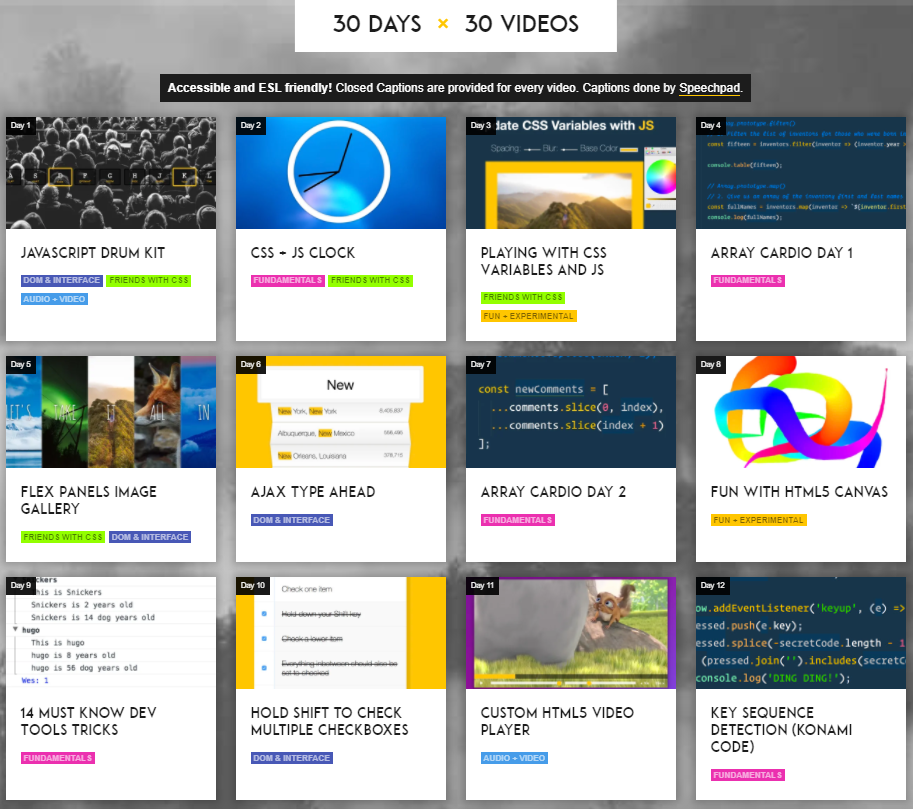

    
   
  
  

   

## 목차

1. [**챌린지 소개**](#1)
2. [**챌린지 진행 일정**](#2)

 

## 💁🏻‍♂ 챌린지 소개

프레임워크, 라이브러리 등을 사용하지 않은 **Vanilla JavaScript**를 사용해 하루에 하나씩 실습을 진행하면서 `30일 동안 30가지`의 실습 과제를 진행해보는 **코딩 챌린지**입니다.

> 2021.09.01. ~ 2021.09.30. 까지 챌린지 수행을 목표로 합니다.

[🔗 JavaScript 30 바로가기 Click!](https://javascript30.com/) 👈

> 새 창 열기 방법 : CTRL+click (on Windows and Linux) | CMD+click (on MacOS)

 

## 📅 챌린지 진행 일정

| No  |                                                                실습 제목                                                                 | 수행 날짜 |
| :-: | :--------------------------------------------------------------------------------------------------------------------------------------: | :-------: |
|  1  |              [JavaScript Drum Kit](https://github.com/JeongHwan-dev/javascript30-course/tree/master/01-JavaScript-Drum-Kit)              |  09.01.   |
|  2  |                 [JS and CSS Clock](https://github.com/JeongHwan-dev/javascript30-course/tree/master/02-JS-and-CSS-Clock)                 |  09.02.   |
|  3  |          [Playing with CSS Variables and JS](https://github.com/JeongHwan-dev/javascript30-course/tree/master/03-CSS-Variables)          |  09.03.   |
|  4  |                [Array Cardio Day1](https://github.com/JeongHwan-dev/javascript30-course/tree/master/04-Array-Cardio-Day1)                |  09.04.   |
|  5  |               [Flex Panel Gallery](https://github.com/JeongHwan-dev/javascript30-course/tree/master/05-Flex-Panel-Gallery)               |  09.05.   |
|  6  |                       [Type Ahead](https://github.com/JeongHwan-dev/javascript30-course/tree/master/06-Type-Ahead)                       |  09.06.   |
|  7  |                [Array Cardio Day2](https://github.com/JeongHwan-dev/javascript30-course/tree/master/07-Array-Cardio-Day2)                |  09.07.   |
|  8  |            [Fun with HTML5 Canvas](https://github.com/JeongHwan-dev/javascript30-course/tree/master/08-Fun-with-HTML5-Canvas)            |  09.08.   |
|  9  |             [Dev Tools Domination](https://github.com/JeongHwan-dev/javascript30-course/tree/master/09-Dev-Tools-Domination)             |  09.09.   |
| 10  |  [Hold Shift and Check Checkboxes](https://github.com/JeongHwan-dev/javascript30-course/tree/master/10-Hold-Shift-and-Check-Checkboxes)  |  09.10.   |
| 11  |              [Custom Video Player](https://github.com/JeongHwan-dev/javascript30-course/tree/master/11-Custom-Video-Player)              |  09.11.   |
| 12  |           [Key Sequence Detection](https://github.com/JeongHwan-dev/javascript30-course/tree/master/12-Key-Sequence-Detection)           |  09.12.   |
| 13  |               [Slide in on Scroll](https://github.com/JeongHwan-dev/javascript30-course/tree/master/13-Slide-in-on-Scroll)               |  09.13.   |
| 14  | [JavaScript References VS Copying](https://github.com/JeongHwan-dev/javascript30-course/tree/master/14-JavaScript-References-VS-Copying) |  09.14.   |
| 15  |                     [LocalStorage](https://github.com/JeongHwan-dev/javascript30-course/tree/master/15-LocalStorage)                     |  09.15.   |
| 16  |                [Mouse Move Shadow](https://github.com/JeongHwan-dev/javascript30-course/tree/master/16-Mouse-Move-Shadow)                |  09.16.   |
| 17  |            [Sort Without Articles](https://github.com/JeongHwan-dev/javascript30-course/tree/master/17-Sort-Without-Articles)            |  09.17.   |
| 18  |      [Adding Up Times with Reduce](https://github.com/JeongHwan-dev/javascript30-course/tree/master/18-Adding-Up-Times-with-Reduce)      |  09.18.   |
| 19  |                       [Webcam Fun](https://github.com/JeongHwan-dev/javascript30-course/tree/master/19-Webcam-Fun)                       |  09.19.   |
| 20  |                 [Speech Detection](https://github.com/JeongHwan-dev/javascript30-course/tree/master/20-Speech-Detection)                 |  09.20.   |
| 21  |                      [Geolocation](https://github.com/JeongHwan-dev/javascript30-course/tree/master/21-Geolocation)                      |  09.21.   |
| 22  |    [Follow Along Link Highlighter](https://github.com/JeongHwan-dev/javascript30-course/tree/master/22-Follow-Along-Link-Highlighter)    |  09.22.   |
